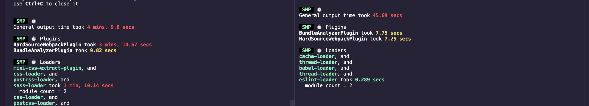

 **CompressionPlugin **  项目代码压缩

```js
const CompressionPlugin = require('compression-webpack-plugin');        
new CompressionPlugin({
  filename: '[path].gz[query]',
  //压缩算法
  algorithm: 'gzip',
  //匹配文件
  test: /\.(js|css|map|ttf)$/,
  //压缩超过此大小的文件,以字节为单位
  threshold: 8192,
  minRatio: 0.8,
  //删除原始文件只保留压缩后的文件
  deleteOriginalAssets: true
})
```

**webpack-theme-color-replacer**  替换主题

```js
const ThemeColorReplacer = require('webpack-theme-color-replacer')
const forElementUI = require('webpack-theme-color-replacer/forElementUI')
config
      .plugin('theme-color-replacer')
      .use(ThemeColorReplacer, [{
        fileName: 'css/theme-colors.[contenthash:8].css',
        matchColors: [
          ...forElementUI.getElementUISeries(process.env.VUE_APP_ELEMENT_COLOR) 
          // Element-ui主色系列
        ],
        externalCssFiles: ['./node_modules/element-ui/lib/theme-chalk/index.css'], 
        // optional, String or string array. Set external css files (such as cdn css) to extract colors.
        changeSelector: forElementUI.changeSelector
      }])
```


***speed-measure-webpack-plugin* **   打包速度

```js
const SpeedMeasurePlugin = require('speed-measure-webpack-plugin')
const smp = new SpeedMeasurePlugin({
  outputFormat: 'human'
})
module.exports = {
  configureWebpack: smp.wrap({
    plugins: []
  })
}
```

**webpack-bundle-analyzer **  打包分析 

```js
// 打包分析
const {BundleAnalyzerPlugin} = require("webpack-bundle-analyzer");

module.exports = {
  plugins: [
    new BundleAnalyzerPlugin({
    //  可以是`server`，`static`或`disabled`。
    //  在`server`模式下，分析器将启动HTTP服务器来显示软件包报告。
    //  在“静态”模式下，会生成带有报告的单个HTML文件。
    //  在`disabled`模式下，你可以使用这个插件来将`generateStatsFile`设置为`true`来生成Webpack Stats JSON文件。
    analyzerMode: "server",
    //  将在“服务器”模式下使用的主机启动HTTP服务器。
    analyzerHost: "127.0.0.1",
    //  将在“服务器”模式下使用的端口启动HTTP服务器。
    analyzerPort: 8866,
    //  路径捆绑，将在`static`模式下生成的报告文件。
    //  相对于捆绑输出目录。
    reportFilename: "report.html",
    //  模块大小默认显示在报告中。
    //  应该是`stat`，`parsed`或者`gzip`中的一个。
    //  有关更多信息，请参见“定义”一节。
    defaultSizes: "parsed",
    //  在默认浏览器中自动打开报告
    openAnalyzer: true,
    //  如果为true，则Webpack Stats JSON文件将在bundle输出目录中生成
    generateStatsFile: false,
    //  如果`generateStatsFile`为`true`，将会生成Webpack Stats JSON文件的名字。
    //  相对于捆绑输出目录。
    statsFilename: "stats.json",
    //  stats.toJson（）方法的选项。
    //  例如，您可以使用`source：false`选项排除统计文件中模块的来源。
    //  在这里查看更多选项：https：  //github.com/webpack/webpack/blob/webpack-1/lib/Stats.js#L21
    statsOptions: null,
    logLevel: "info"
  )
  ]
}
```


**hard-source-webpack-plugin** 这个是为模块提供中间缓存，效率提升很大。

```js
const HardSourceWebpackPlugin = require('hard-source-webpack-plugin')
module.exports = {
  configureWebpack: smp.wrap({
    plugins: [
      // 为模块提供中间缓存，缓存路径是：node_modules/.cache/hard-source
      new HardSourceWebpackPlugin(),
      new BundleAnalyzerPlugin()
    ]
  })
}

```


**多进程/多实例** 

 `webpack` 是运行在 `node` 环境中，而 `node` 是单线程的。`webpack` 的打包过程是 `io` 密集和计算密集型的操作，如果能同时 `fork` 多个进程并行处理各个任务，将会有效的缩短构建时间。

平时用的比较多的两个是`thread-loader`和`HappyPack`。

先来看下`thread-loader`吧，这个也是`webpack4`官方所推荐的。

```js
module.exports = {
  module: {
    rules: [
      {
        test: /\.js$/,
        include: path.resolve("src"),
        use: [
          "thread-loader",
          // your expensive loader (e.g babel-loader)
        ]
      }
    ]
  }
}
```




`HappyPack` 可以让 `Webpack` 同一时间处理多个任务，发挥多核 `CPU` 的能力，将任务分解给多个子进程去并发的执行，子进程处理完后，再把结果发送给主进程。通过多进程模型，来加速代码构建。

```js
// webpack.config.js
const HappyPack = require('happypack');

exports.module = {
  rules: [
    {
      test: /.js$/,
      // 1) replace your original list of loaders with "happypack/loader":
      // loaders: [ 'babel-loader?presets[]=es2015' ],
      use: 'happypack/loader',
      include: [ /* ... */ ],
      exclude: [ /* ... */ ]
    }
  ]
};

exports.plugins = [
  // 2) create the plugin:
  new HappyPack({
    // 3) re-add the loaders you replaced above in #1:
    loaders: [ 'babel-loader?presets[]=es2015' ]
  })
];
```


`thread-loader` 和 `happypack` 对于小型项目来说打包速度几乎没有影响，甚至可能会增加开销，所以建议尽量在大项目中采用。

**1. 速度分析**

**2. 体积分析**

**3. 多进程/多实例构建**

**4. 多进程并行压缩代码**

**5. 预编译资源模块**

在使用`webpack`进行打包时候，对于依赖的第三方库，比如`vue`，`vuex`等这些不会修改的依赖，我们可以让它和我们自己编写的代码分开打包，这样做的好处是每次更改我本地代码的文件的时候，`webpack`只需要打包我项目本身的文件代码，而不会再去编译第三方库。

那么第三方库在第一次打包的时候只打包一次，以后只要我们不升级第三方包的时候，那么`webpack`就不会对这些库去打包，这样的可以快速的提高打包的速度。其实也就是`预编译资源模块`。

​	`DllPlugin` `DllReferencePlugin`

**6. 利用缓存提升二次构建速度**

一般来说，对于静态资源，我们都希望浏览器能够进行缓存，那样以后进入页面就可以直接使用缓存资源，页面打开速度会显著加快，既提高了用户的体验也节省了宽带资源。

当然浏览器缓存方法有很多种，这里只简单讨论下在`webpack`中如何利用缓存来提升二次构建速度。

在`webpack`中利用缓存一般有以下几种思路：

- `babel-loader`开启缓存
- 使用`cache-loader`
- 使用`hard-source-webpack-plugin`

**7. 缩小构建目标/减少文件搜索范围**

有时候我们的项目中会用到很多模块，但有些模块其实是不需要被解析的。这时我们就可以通过缩小构建目标或者减少文件搜索范围的方式来对构建做适当的优化。

**8. 动态Polyfill**

介绍`动态Polyfill`前，我们先来看下什么是`babel-polyfill`。

### 什么是 babel-polyfill?

`babel`只负责语法转换，比如将`ES6`的语法转换成`ES5`。但如果有些对象、方法，浏览器本身不支持，比如：

- 全局对象：`Promise`、`WeakMap` 等。
- 全局静态函数：`Array.from`、`Object.assign` 等。
- 实例方法：比如 `Array.prototype.includes` 等。

此时，需要引入`babel-polyfill`来模拟实现这些对象、方法。

**9.  Scope Hoisting **

`Scope hoisting` 直译过来就是「作用域提升」。熟悉 `JavaScript` 都应该知道「函数提升」和「变量提升」，`JavaScript` 会把函数和变量声明提升到当前作用域的顶部。「作用域提升」也类似于此，`webpack` 会把引入的 `js` 文件“提升到”它的引入者顶部。

`Scope Hoisting` 可以让 `Webpack` 打包出来的代码文件更小、运行的更快。


**[你可能不知道的9条Webpack优化策略](https://segmentfault.com/a/1190000038376591)**


